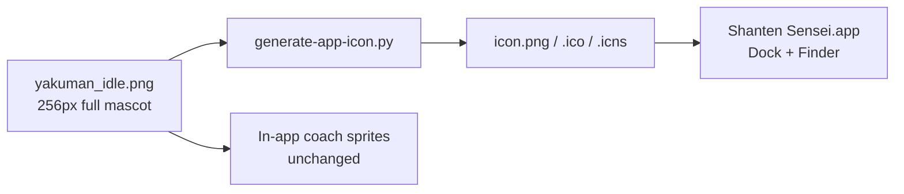

# Simplify Yakuman app icon

## Problem

The main app icon is generated from the full [`yakuman_idle.png`](file:///Users/rebeccaclarke/a_new_projects_folder/shanten-sensei-overlay/resources/yakuman_idle.png) mascot via [`scripts/generate-app-icon.py`](file:///Users/rebeccaclarke/a_new_projects_folder/shanten-sensei-overlay/scripts/generate-app-icon.py). At Dock/Finder sizes (16–32px), the full-body pose—with legs, mini 1-pin tile, sparkles, and fine outline detail—reads as muddy noise.



**Scope:** macOS app icon only (overlay repo). The detailed sprites in [`web/yakuman_idle.png`](web/yakuman_idle.png) and overlay `resources/yakuman_*.png` stay as-is for the “Yakuman says” UI avatar.

## Design direction (per your preference)

**Close-up of the top half of Yakuman, including arms** — not a full redesign:

- Keep: cream tile, green 發, cheerful face, raised finger + other arm
- Remove from icon frame: legs/feet, excess empty backdrop
- Tighten: crop and scale so the character fills ~80% of the icon square (readable at 16px)
- Background: keep existing teal `BG = (97, 209, 211)` from the generator (matches companion window chrome)

If the close-up crop still feels busy at 16px after tuning, fall back to a **chibi tile** variant (face + 發 only, no arms) as `yakuman_icon.png` — same pipeline, different source file.

## Implementation (overlay repo)

All changes live in **shanten-sensei-overlay** (sibling repo, not this workspace).

### 1. Add a dedicated icon source asset

Create [`resources/yakuman_icon.png`](file:///Users/rebeccaclarke/a_new_projects_folder/shanten-sensei-overlay/resources/yakuman_icon.png) (~512×512, transparent or dark backdrop):

- Start from existing `yakuman_idle.png`
- Crop to upper ~70–75% (tile + arms, no legs)
- Center horizontally; trim side padding
- Optionally erase sparkle lines near the fingertip (they vanish at small sizes anyway)

This separates “icon source” from “UI mascot” so future mascot updates don’t accidentally regress the app icon.

### 2. Update the icon generator

In [`scripts/generate-app-icon.py`](file:///Users/rebeccaclarke/a_new_projects_folder/shanten-sensei-overlay/scripts/generate-app-icon.py):

- Change `SRC` from `yakuman_idle.png` → `yakuman_icon.png`
- Refactor `yakuman_to_icon()` to:
  1. Load source RGBA
  2. Strip dark backdrop pixels (existing `_is_backdrop` logic)
  3. **Auto-trim** non-transparent bounding box (PIL `Image.getbbox()`)
  4. Paste trimmed sprite centered on teal square with ~10% padding
  5. Resize to `ICON_SIZE` (400) with LANCZOS
- Keep existing `write_ico()` / `write_icns()` unchanged

```python
# New core logic (sketch)
trimmed = remove_backdrop_and_trim(src)
canvas = Image.new("RGBA", (ICON_SIZE, ICON_SIZE), BG)
scale = fit_with_padding(trimmed, canvas, pad_ratio=0.10)
canvas.paste(scaled, offset, mask=scaled)
```

### 3. Regenerate bundled icons

Run on macOS:

```bash
cd shanten-sensei-overlay
python scripts/generate-app-icon.py
```

Outputs (commit these):

- `resources/icon.png` — also used by Tk window icon in [`gui/main_gui.py`](file:///Users/rebeccaclarke/a_new_projects_folder/shanten-sensei-overlay/gui/main_gui.py) line 36
- `resources/icon.ico`
- `resources/icon.icns` — used by PyInstaller [`ShantenSensei.spec`](file:///Users/rebeccaclarke/a_new_projects_folder/shanten-sensei-overlay/ShantenSensei.spec) and install scripts

### 4. Visual QA at small sizes

Manually inspect regenerated assets at:

| Size | Where it appears |
|------|------------------|
| 16×16, 32×32 | Dock (compact), Finder list view |
| 128×128 | Finder icon view |
| 256×400 | `icon.png` preview, About window |

**Pass criteria:** 發 character and face silhouette recognizable; no leg clutter; no sparkle noise; teal background consistent.

Rebuild `.app` locally (`pyinstaller ShantenSensei.spec`) only if you want to verify the `.icns` in Applications — not required for the asset fix itself.

## What we are NOT changing

| Asset | Reason |
|-------|--------|
| `yakuman_idle.png` / `yakuman_talk.png` (both repos) | In-app coach avatar at 56px — detail is fine there |
| `web/review.html` | No favicon today; out of scope unless you want one later |
| PyInstaller spec | Already points at `icon.icns`; no spec change needed |

## Optional follow-up (out of scope)

- Add matching favicon to review UI (`sensei serve`) using the same `yakuman_icon.png`
- Ship icon refresh in next overlay GitHub Release so existing installs pick it up on reinstall

## Files touched

| Repo | File | Change |
|------|------|--------|
| shanten-sensei-overlay | `resources/yakuman_icon.png` | **New** simplified/cropped source |
| shanten-sensei-overlay | `scripts/generate-app-icon.py` | Use new source + trim/pad logic |
| shanten-sensei-overlay | `resources/icon.png`, `icon.ico`, `icon.icns` | Regenerated |
