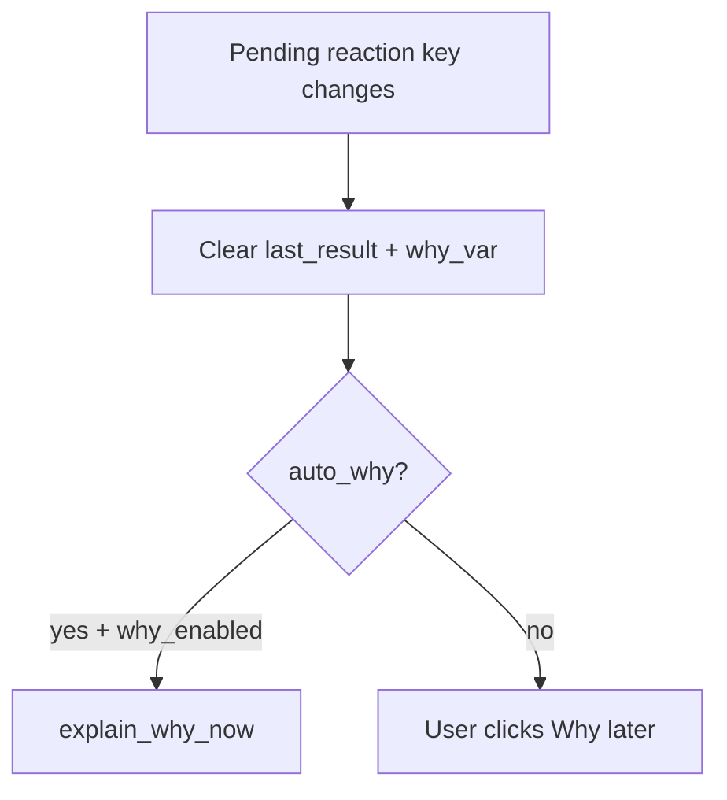

# Stale Why blanking + opt-in Auto Why?

Work lives in the sibling overlay [`../shanten-sensei-overlay`](../shanten-sensei-overlay). This repo only needs a short docs note.

## Problem

AI Guidance updates on every pending Mortal reaction, but Why stays on screen (`SenseiCoach.last_result` + GUI `why_var`) until game end or another Why? click. There is no invalidate-on-advice-change path.

## Behavior

| Setting | When advice changes / clears |
|---------|------------------------------|
| `auto_why=False` (default) | Blank Why + status strip immediately |
| `auto_why=True` | Blank briefly, then auto-call Why for the new pending reaction (same LLM/template path as the button) |

Manual **Why?** button stays as-is. Cache by reaction key still avoids re-LLM when advice has not changed.



## Implementation (overlay)

### 1. Setting: `auto_why` default `False`

- [`common/settings.py`](../shanten-sensei-overlay/common/settings.py) — add next to other `auto_*` bools:
  `self.auto_why: bool = self._get_value("auto_why", False, self.valid_bool)`
- [`gui/settings_window.py`](../shanten-sensei-overlay/gui/settings_window.py) — checkbox; save assigns `self.st.auto_why`
- [`common/lan_str.py`](../shanten-sensei-overlay/common/lan_str.py) — e.g. `AUTO_WHY = "Auto Why? (uses API each new tip)"` (+ Chinese mirror)

### 2. Invalidate on stale advice — [`sensei_adapter.py`](../shanten-sensei-overlay/sensei_adapter.py)

Add something like:

```python
def sync_with_reaction(self, reaction, game_info) -> bool:
    """Clear Why if reaction is gone or key differs. Returns True if still current."""
    if not reaction:
        if self.last_result is not None:
            self.clear()
        return False
    key = self._key(reaction, game_info)
    if self._cache_key is not None and key != self._cache_key:
        self.clear()
        return False
    return self._cache_key == key and self.last_result is not None
```

### 3. Hook in bot loop — [`bot_manager.py`](../shanten-sensei-overlay/bot_manager.py)

In `update_overlay()` (already drains `_why_request` and refreshes guidance):

1. Get pending reaction + game info.
2. Call `sensei.sync_with_reaction(...)`.
3. If not current, `why_enabled`, and `self.st.auto_why` → set `_why_request` / call `explain_why_now()` (same path as button; cache prevents spam on unchanged key).
4. Keep existing end-game `sensei.clear()`.

Also stop appending stale Why lines in `_update_overlay_botleft` once `last_result` is cleared (already follows `last_result`).

### 4. GUI must blank, not only set — [`gui/main_gui.py`](../shanten-sensei-overlay/gui/main_gui.py)

Today (~412–417) only sets `why_var` when `why.ok`; never clears. After sync:

```python
why = self.bot_manager.get_last_why()
if why and why.ok:
    self.why_var.set(why.summary)
else:
    self.why_var.set("")
# same pattern for status_strip_var when status is None
```

## Docs (this repo)

Update [`docs/live-setup.md`](docs/live-setup.md): Why blanks when the tip changes; Settings → **Auto Why?** regenerates automatically (API cost per new tip).

## Verify

1. Default: get a Why?, wait for new Mortal tip → Why box clears; click Why? again for new text.
2. Enable Auto Why?: new tip → Why refreshes without click (LLM if key set, else template).
3. Ranked / `why_enabled=False`: no auto call; Why stays cleared/disabled.
4. Same tip twice: cache hit, no second LLM call.
