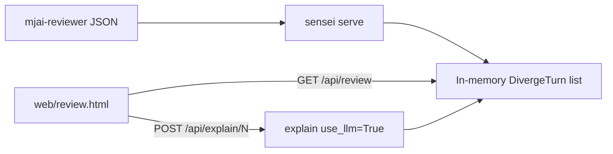

# Standalone review page (`sensei serve`)

## Goal

Close the Phase 1 checklist item: **Review UI with diverge list + persistent status strip + on-demand Why?**

Chosen approach: **local Python server + LLM on Why? click**.

```bash
uv run --python .venv/bin/python sensei serve game_logs/review.json
# → http://127.0.0.1:8765
```

No React, no FastAPI — keep the Python-only stack. Stdlib `http.server` + one static HTML page.

## Architecture



- On startup: load report via existing [`diverge_turns_from_path`](src/shanten_sensei/ingest.py) (or blob equivalent). **Do not** call `explain()` for every diverge.
- Page load: list + status strip only (free).
- Why? click: `POST /api/explain/{index}` → `explain(turn, use_llm=True)` → return `Explanation` + `grounding_errors`.

## CLI

In [`src/shanten_sensei/cli.py`](src/shanten_sensei/cli.py):

```text
sensei serve <report.json> [--host 127.0.0.1] [--port 8765] [--limit N]
```

- Reuse `--limit` for smoke / big reports.
- Bind localhost by default (practice/review only).
- Print URL on start; Ctrl+C to stop.
- If no API key when Why? is clicked, return a clear JSON error (do not silently fall back to template on the Why? path — user chose LLM on click). Optional later: `?fallback=template` — out of scope for v1.

## HTTP API

New module [`src/shanten_sensei/serve.py`](src/shanten_sensei/serve.py):

| Route | Behavior |
|-------|----------|
| `GET /` | Serve `web/review.html` |
| `GET /api/review` | Diverge list payload (no explanations) |
| `POST /api/explain/{index}` | LLM explain for 1-based diverge index; cache result in memory for the process lifetime |

### `GET /api/review` shape

```json
{
  "log_id": "...",
  "diverge_count": 2,
  "diverges": [
    {
      "index": 1,
      "kyoku": 0,
      "honba": 0,
      "junme": 8,
      "mortal_best": "dahai 9p",
      "player_action": "dahai 5s",
      "shanten": 0,
      "ukeire": 6,
      "statuses": {
        "menzen": true,
        "tenpai": true,
        "shanten": 0,
        "furiten": false,
        "temporary_furiten": false,
        "riichi": false,
        "ippatsu": false,
        "wait_shape": "ryanmen",
        "dora_in_hand": [],
        "visible_dora": []
      },
      "danger": {}
    }
  ]
}
```

Strip fields match full [`HandStatuses`](src/shanten_sensei/schema.py) plus shanten/ukeire/danger — richer than the CLI one-liner, per README status table.

### `POST /api/explain/{index}` shape

```json
{
  "index": 1,
  "explanation": {
    "summary": "...",
    "focus": "efficiency",
    "pinned_action": "dahai 9p",
    "contrasted_action": "dahai 5s"
  },
  "grounding_errors": []
}
```

- `use_llm=True` always on this route.
- 404 if index out of range; 502/503-style JSON if API key missing or LLM call fails.
- In-process cache: second click returns the same explanation without another API call.

## UI ([`web/review.html`](web/review.html))

Single self-contained page (inline CSS/JS, no build step). Layout:

1. **Header** — log id / diverge count; practice-only reminder.
2. **Diverge list** — rows: `E{n} · kyoku/honba · junme · Mortal vs Player`.
3. **Detail panel** (selected row):
   - **Status strip** (persistent): menzen/open · tenpai/N-shanten · wait · furiten · riichi/ippatsu · dora · ukeire count · danger tags if present.
   - Mortal / Player labels.
   - **Why?** button → calls `/api/explain/{index}`; shows summary + focus; shows grounding warnings if any.
   - Loading / error states on the button.

No board rendering, no tile graphics, no companion overlay into mjai-reviewer HTML. Keep it a coaching list.

Ship `web/` next to the package; resolve path relative to repo root and/or package resources so `sensei serve` works from an editable install (`uv pip install -e .`).

## Tests

[`tests/test_serve.py`](tests/test_serve.py):

- Start handler against [`fixtures/review_mini/report.json`](fixtures/review_mini/report.json) (2 diverges).
- `GET /api/review` → `diverge_count == 2`, statuses present, no `explanation` keys.
- `POST /api/explain/1` with monkeypatched `explain` (or env forcing a stub) → returns pinned explanation; second POST hits cache (assert call count == 1).
- Invalid index → 404.

No live LLM in CI.

## Docs

- [`README.md`](README.md): check off Review UI; add:

```bash
uv run --python .venv/bin/python sensei serve fixtures/review_mini/report.json
# Why? needs OPENAI_API_KEY or SENSEI_API_KEY
```

- One sentence in [`docs/phase1-contract.md`](docs/phase1-contract.md): full reports can be browsed via `sensei serve`.

## Out of scope

- Live overlay / Majsoul websocket (Phase 2)
- Injecting into `game_logs/Killer Mortal Reviewer.html`
- Board / hand tile rendering
- “Deeper” second-click paragraph
- FastAPI / React / bundler
- Template fallback on the Why? route (v1 is LLM-only)
- Enriching discards/dora from full `mjai_log` (leave ingest as-is)

## File touch list

| Path | Change |
|------|--------|
| `src/shanten_sensei/serve.py` | New: HTTP handler + review session |
| `src/shanten_sensei/cli.py` | `serve` subcommand |
| `web/review.html` | New: UI |
| `tests/test_serve.py` | New: API smoke |
| `README.md`, `docs/phase1-contract.md` | Docs + checklist |
