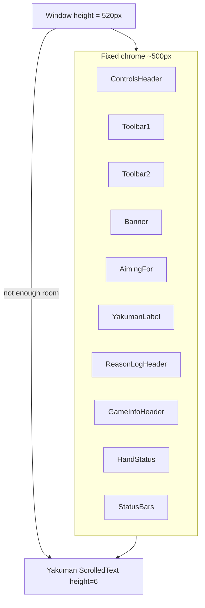

# Startup Controls + Yakuman visibility

## Problem

The desktop coach UI lives in the sibling overlay repo ([`shanten-sensei-overlay/gui/main_gui.py`](file:///Users/rebeccaclarke/a_new_projects_folder/shanten-sensei-overlay/gui/main_gui.py)), not this repo.

Your screenshot matches the root cause: **Controls are expanded**, the **“Yakuman says” label is visible**, but the **intro text box is crushed to a thin sliver** above Reason log / Hand status.



**Why the earlier “make window larger” change didn’t stick:**
- Compact default is only **480×520** ([`gui/utils.py`](file:///Users/rebeccaclarke/a_new_projects_folder/shanten-sensei-overlay/gui/utils.py) `window_size()`), but with both toolbar rows open the fixed chrome needs **~580–620px** before the Yakuman text area gets meaningful height.
- Geometry is set once in `__init__` **before** widgets are fully laid out; macOS/tk often needs a post-layout `update_idletasks()` + second `geometry()` call to honor the intended size.
- If `settings.json` has `"hide_toolbars": true`, startup honors it via line 172 and opens with Controls collapsed (you chose to override this).

**Note:** “Yakuman says” is not a collapsible section today — Reason log and Game Info are the collapsed `▸` rows. The fix is making the Yakuman **content** visible, not adding a new toggle.

## Changes (overlay repo)

### 1. Increase compact default height when toolbars are shown

In [`gui/utils.py`](file:///Users/rebeccaclarke/a_new_projects_folder/shanten-sensei-overlay/gui/utils.py):

- Bump compact **with toolbars** from `(480, 520)` → **`(480, 620)`** (room for Controls + Yakuman intro at `height=6`).
- Keep collapsed-toolbars height logic using `TOOLBAR_COLLAPSE_DELTA` (620 − 156 = **464**, still above the 300 floor).
- Update `_adapt_layout_height()` preferred threshold in [`main_gui.py`](file:///Users/rebeccaclarke/a_new_projects_folder/shanten-sensei-overlay/gui/main_gui.py) to match the new compact default (620).

Update [`tests/test_toolbar_collapse.py`](file:///Users/rebeccaclarke/a_new_projects_folder/shanten-sensei-overlay/tests/test_toolbar_collapse.py) expected values.

### 2. Guarantee Yakuman row minimum height

In `_create_widgets()` where `why_row` is configured (~line 268):

```python
self.grid_frame.grid_rowconfigure(cur_row, weight=2, minsize=110)
```

This prevents the intro `ScrolledText` from being squeezed below ~5 visible lines when the window is resized shorter.

### 3. Always start with Controls open (your choice)

In [`main_gui.py`](file:///Users/rebeccaclarke/a_new_projects_folder/shanten-sensei-overlay/gui/main_gui.py) `_create_widgets()`:

- Replace honoring saved `hide_toolbars` on cold start with:

```python
self._set_toolbars_visible(True, persist=False)
```

- Keep `hide_toolbars` writable during the session (user can still collapse Controls while playing), but **do not persist** collapse to `settings.json` on toggle — remove `save_json()` from `_set_toolbars_visible` when `hide_toolbars` changes, or stop writing `hide_toolbars` entirely so every launch resets to open.
- Yakuman intro is already set on build via `_set_why_text(YAKUMAN_INTRO)` — no new toggle needed.

### 4. Fix geometry application on open (why prior bump failed)

Add `_apply_startup_geometry()` on `MainGUI`:

```python
def _apply_startup_geometry(self) -> None:
    self.update_idletasks()
    size, min_size = self._window_sizes(self.st.hide_ai_options, self.st.hide_toolbars)
    self.minsize(*min_size)
    self.geometry(f"{size[0]}x{size[1]}")
```

Call sites:
- End of `_create_widgets()` via `self.after_idle(self._apply_startup_geometry)` (after `_adapt_layout_height` idle chain).
- Replace direct `geometry()` in `__init__` with this helper (or keep initial call + re-apply after layout).
- Fix `reload_gui()` bug: pass `self.st.hide_toolbars` into `_window_sizes()` (currently omitted at line 768).

Pattern mirrors the Settings dialog fix documented in [`.cursor/plans/settings_window_size_ae30f9fd.plan.md`](file:///Users/rebeccaclarke/a_new_projects_folder/shanten_sensei/.cursor/plans/settings_window_size_ae30f9fd.plan.md) — size must be applied after layout, not only at construction time.

### 5. Optional cleanup in settings

In [`common/settings.py`](file:///Users/rebeccaclarke/a_new_projects_folder/shanten-sensei-overlay/common/settings.py):

- Stop loading/saving `hide_toolbars` (session-only), **or** ignore it on startup and never persist toggles. Simplest: remove persistence so stale `"hide_toolbars": true` in existing `settings.json` cannot affect launch.

## Out of scope

- Making Reason log / Game Info expanded by default (still collapsed `▸` — keeps window focused on Yakuman coaching).
- Changes to the browser review page (`review.html` in this repo).
- Persisting user-resized window dimensions across launches (can be a follow-up if macOS keeps restoring a short frame).

## Verification

1. Delete or edit `~/Library/Application Support/ShantenSensei/settings.json` — set `"hide_toolbars": true` to confirm startup still opens Controls expanded.
2. Launch overlay in compact mode (default): window should open **~480×620**, Controls expanded, Yakuman intro fully readable without scrolling.
3. Collapse Controls during session → window shrinks; quit and relaunch → Controls expanded again.
4. Resize window shorter → Hand status / Game Info headers may hide per `_adapt_layout_height`, but Yakuman row stays at least ~110px.
5. Run `pytest tests/test_toolbar_collapse.py` in overlay repo.

## Files touched

| File | Change |
|------|--------|
| [`shanten-sensei-overlay/gui/utils.py`](file:///Users/rebeccaclarke/a_new_projects_folder/shanten-sensei-overlay/gui/utils.py) | Compact default height 520 → 620 |
| [`shanten-sensei-overlay/gui/main_gui.py`](file:///Users/rebeccaclarke/a_new_projects_folder/shanten-sensei-overlay/gui/main_gui.py) | Startup geometry helper, force Controls open, Yakuman row minsize, adapt threshold, reload_gui fix |
| [`shanten-sensei-overlay/common/settings.py`](file:///Users/rebeccaclarke/a_new_projects_folder/shanten-sensei-overlay/common/settings.py) | Stop persisting `hide_toolbars` (optional but recommended) |
| [`shanten-sensei-overlay/tests/test_toolbar_collapse.py`](file:///Users/rebeccaclarke/a_new_projects_folder/shanten-sensei-overlay/tests/test_toolbar_collapse.py) | Update size assertions |
