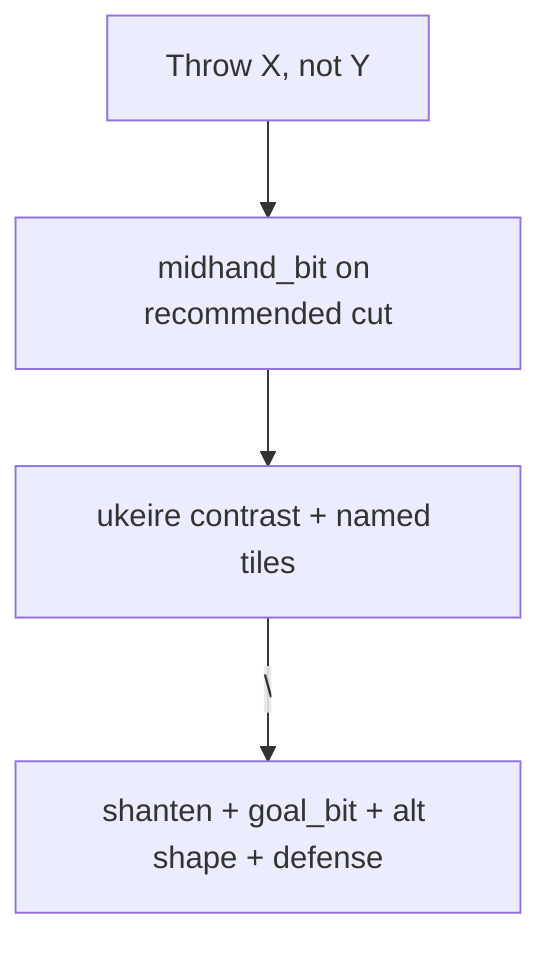

# Teaching-first discard tip order

## Problem

In contrast tips like your screenshot, paragraph 1 is all efficiency math:

```
Throw South, not 8-pin.
That leaves about 23 improving tiles left vs about 20 if you throw 8-pin.
Throwing South keeps draws like …
If you threw 8-pin instead, you'd mostly improve via …

You're 2-shanten.
That fits pinfu … with dora 6-man.
South is a floating honor outside pinfu.
8-pin clears a closed middle (kanchan) shape.
```

For beginners, the actionable beat is **what to throw** then **why** — the floating-honor / dead-end / kanchan reason on Mortal’s cut. Ukeire counts are supporting evidence and should follow.

## Target layout

```
Throw South, not 8-pin.
South is a floating honor outside pinfu (closed all-sequences; no value pair).
That leaves about 23 improving tiles left vs about 20 if you throw 8-pin.
Throwing South keeps draws like …
If you threw 8-pin instead, you'd mostly improve via …

You're 2-shanten.
That fits pinfu … with dora 6-man.
8-pin clears a closed middle (kanchan) shape.
```

Same rule for all recommended-cut `midhand_bit` kinds: `floating_honor`, `floating_terminal`, `dead_end`, `isolated_kanchan`, `isolated_penchan`.

**Unchanged:**
- Paragraph break still between move block and state block ([`explanation_line_break` plan](.cursor/plans/explanation_line_break_aabbe9fc.plan.md))
- Alternate-cut shape notes (8-pin kanchan) stay in paragraph 2
- Defense-led tips still skip shape teaching on the cut
- Yakuhai bundled `shape_sentence` voice stays as-is (different code path)



## Implementation

### 1. Hoist `midhand_bit` into move paragraph (position 2)

**File:** [`src/shanten_sensei/explain.py`](src/shanten_sensei/explain.py) — `_template_explain_body` (~1886–2004)

After the throw lead is appended (`Throw X` / `Throw X, not Y`):

```python
midhand_bit = _midhand_shape_clause(turn, best_raw, best_tile)
if midhand_bit and not defense_led:
    move_sents.append(_sentence_case(midhand_bit))
    midhand_bit = None  # consumed — do not re-append in state
```

Move the `_midhand_shape_clause` call **up** (before ukeire/wall notes) so it is available early. Remove or bypass the later `midhand_bit` append/dash-glue/newline-join branches when already consumed.

**Dash-glue cleanup:** Today non-dora `goal_bit` can em-dash-glue `midhand_bit` (`That fits tanyao—West is a floating honor…`). With hoisting, that glue path becomes dead for recommended-cut notes — `goal_bit` stays a clean `That fits tanyao` line in paragraph 2.

**Dora newline-join cleanup:** The `chiitoi + dora` fix ([`chiitoi_dora_line_breaks` plan](.cursor/plans/chiitoi_dora_line_breaks_e777036b.plan.md)) separated dora goal from floating-honor reason in paragraph 2. After hoisting, West’s floating-honor line moves to paragraph 1; paragraph 2 keeps `That fits chiitoi with dora …` plus North’s alternate floating-honor note only.

**Tanyao terminal branch:** The `—{best_tile} can't stay in that hand` suffix on `shape_sentence` (~1973–1974) should also hoist to position 2 when it fires (same “why throw this” beat).

### 2. Non-contrast path consistency

When there is no ukeire contrast (`has_efficiency_lead` is false), shanten+ukeire still bundles into `move_sents` after the throw. With hoisting, order becomes:

```
Throw 9-pin, not 5-sou.
9-pin is a floating terminal outside tanyao.
You're 2-shanten with about 40 improving tiles.
```

No structural change needed beyond the same early `midhand_bit` append — it naturally lands before the bundled shanten line.

### 3. SYSTEM_PROMPT alignment

**File:** [`src/shanten_sensei/explain.py`](src/shanten_sensei/explain.py) — `SYSTEM_PROMPT` (~89–205)

- Add rule: after `Throw X` / `Throw X, not Y`, put the recommended cut’s shape reason next (floating honor, dead-end, kanchan/penchan clear) before ukeire contrast or named tiles.
- Update the ukeire-contrast example to show shape reason on line 2.
- Update the tanyao discard example (currently shows shape reason only in paragraph 2).

### 4. Tests

| File | Change |
|------|--------|
| [`tests/eval/test_template_goldens.py`](tests/eval/test_template_goldens.py) | `test_template_tanyao_honor_ukeire_contrast`: assert `floating honor` appears in **move** paragraph, before `vs about` |
| Same | `test_template_chiitoi_dora_separate_from_floating_honor_cut`: line 2 = West floating honor; line with `That fits chiitoi` moves to state paragraph |
| [`tests/test_explanation_substance.py`](tests/test_explanation_substance.py) | Any contrast fixtures that assert paragraph split — update expected positions |
| New golden (optional) | Screenshot-shaped pinfu + dora + South vs 8-pin: assert move block order `Throw` → `floating honor` → `vs about` |

Run: `uv run pytest tests/test_explanation_substance.py tests/eval/test_template_goldens.py tests/test_grounding.py -q`

No grounding validator changes expected — same substrings, different order.

## Out of scope

- Moving `goal_bit` (“That fits pinfu with dora”) before ukeire — stays with shanten in paragraph 2
- Merging duplicate floating-honor lines when both cuts are floating honors
- Overlay / review UI changes (`\n` rendering already works)
