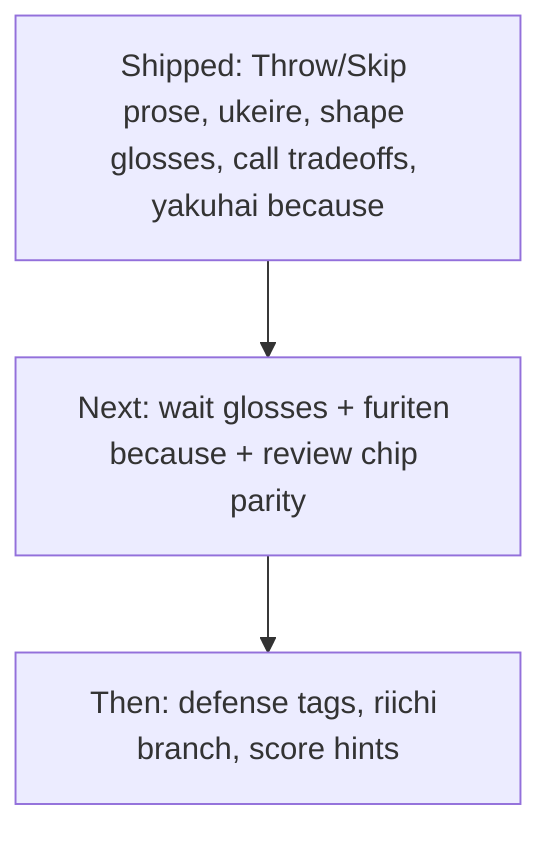

# Teaching gaps after current coaching work

You already have a strong **efficiency + shape + call** coach. Mortal still picks the move; Sensei only verbalizes grounded facts ([`explain.py`](src/shanten_sensei/explain.py), [`features.py`](src/shanten_sensei/features.py), [`glosses.py`](src/shanten_sensei/glosses.py)). The README already promises suji/one-chance, wait pedagogy, and score/riichi context that are only partially real today.

## What is already working well

- Discard: Throw X / improving-tiles contrast / fits {yaku}
- Calls: Skip vs Call + menzen/riichi / open shanten
- Shape goals + beginner glosses; yakuhai “because” (Sensei side); Yaku list URL constant
- Status chips / furiten / wait_shape computed — but wait terms stay jargon (`That keeps a ryanmen wait shape`)

## Ranked gaps (beginner → intermediate impact)

1. **Wait-shape plain English** — `classify_wait_shape` exists; template still says raw `ryanmen` / `kanchan`. Same gloss pattern as `GOAL_GLOSS` would unlock the README’s “two-sided wait” voice immediately when tenpai.
2. **Furiten “because”** — `statuses.furiten` + discard∩wait are computed; Why? almost never names which discarded wait tiles block you.
3. **Review teaching parity** — live has Aiming-for + glossed prose; [`web/review.html`](web/review.html) still shows raw chips (`3-shanten`, `wait ryanmen`) and no Aiming-for strip; calls can look like JSON.
4. **Defense beyond genbutsu** — [`basic_danger_tags`](src/shanten_sensei/features.py) only tags genbutsu; README lists suji/one-chance. When Mortal folds, Why? often still sounds like efficiency.
5. **Riichi declare vs pass** — `reach` is classified in [`tiles.py`](src/shanten_sensei/tiles.py) but there is no call-style tip branch (tenpai + wait + dora + furiten facts).
6. **Point situation** — `scores` / riichi flags are on the turn payload but unused in template (push/fold, all-last urgency).
7. **Deeper yaku paths** — `pinfu` / `ittsu` / etc. are validation-blocked if the LLM invents them; expand heuristics only when detection is reliable.
8. **Mid-hand efficiency labels** — floating terminals, closed kanchan before tenpai (nice-to-have after waits gloss).

Finish the in-flight [yakuhai because + Yaku list overlay button](.cursor/plans/yakuhai_because_link_a9d15a71.plan.md) first if that button is still incomplete — it is the natural companion to Aiming-for.

## Recommended next implementation (locked)

Ship a **small “tenpai literacy” slice** before defense/score work:

### A. Wait-shape glossary ([`glosses.py`](src/shanten_sensei/glosses.py) + [`explain.py`](src/shanten_sensei/explain.py))

Add `WAIT_GLOSS` mirroring goals:

- `ryanmen` → two-sided open wait
- `kanchan` → closed middle wait
- `penchan` → edge wait
- `tanki` → pair wait
- `shanpon` → two-pair wait
- `complex` → multiple wait types

Template: `That keeps a ryanmen wait shape` → `That keeps a ryanmen (two-sided open) wait`. Reuse in substance anchors if needed.

### B. Furiten because clause

When `statuses.furiten` and the tip is about waiting/defense/pass, append which wait tiles appear in the player’s discards (from existing `is_furiten` inputs). One short sentence only.

### C. Review chip / Aiming parity ([`web/review.html`](web/review.html) + serve payload if needed)

- Show Aiming-for via existing `format_aiming_for(shape_goals)`
- Gloss shanten / wait chips the same way live Why? does
- Humanize call labels with `coach_action_label` where review shows mjai codes

### Explicitly defer (still valuable later)

- **Suji / one-chance** danger expansion + defense-focus template sentences when Mortal’s cut is safer
- **Riichi tip branch** parallel to call coaching (`Declare riichi` / `Stay silent`)
- **Score-context one-liners** from relative scores + opponent riichi + wall thinness
- Hover tooltips / in-app glossary UI (parentheticals + Yaku list are enough for now)
- Full EV / post-call best-discard search

## Success check

A tenpai diverge in review or live Why? should read like:

> Throw 4-man, not 6-man. That keeps a ryanmen (two-sided open) wait. You’re furiten on 7-sou—you already discarded it—so this is for defense, not a win this turn.

…instead of bare `ryanmen` + silent furiten chip.
