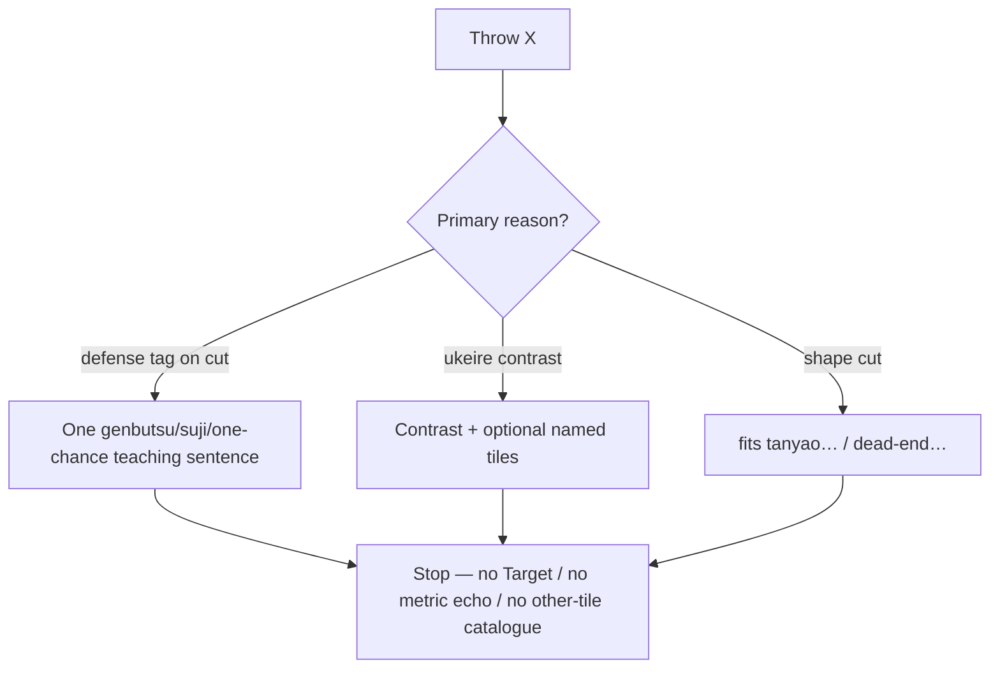

# Tighten tip verbosity (redundancy + defense)

## Target voice (screenshot rewrite)

Today (overboard):

> Throw 9-sou. 9-sou is genbutsu — … can’t ron it…. 2-pin and 4-pin are also genbutsu. 9-man and 6-sou sit on suji lines…. You’re 2-shanten … with 24 improving tiles. Mortal’s cut is 9-sou. Target: tanyao, pinfu.

After:

> Throw 9-sou. An opponent already discarded it, so they can’t ron it from you.

Keep stacking only when that fact *is* the reason (ukeire contrast, cutting a terminal for tanyao, call tradeoffs, etc.). Hand stats + Aiming for stay the home for metrics/yaku.

## Locked defaults

- **2–3 sentences**, not 3–4; [`SUMMARY_WORD_LIMIT`](src/shanten_sensei/explain.py) **130 → 90**.
- Defense: **recommended cut only** — never list other hand tiles’ genbutsu/suji.
- Drop from tips when UI already shows them: bare `You’re N-shanten with M improving tiles`, `Target: …` / trailing `fits tanyao…` on defense-led tips, and any `Mortal’s cut is X` restatement.
- Keep ukeire **contrast** (`about N vs about M if you throw …`) and shape goals when they justify the cut (e.g. terminal out of tanyao).
- Detail paragraph still exists for review API, but merge must not re-inflate the bubble.

## Code changes — [`src/shanten_sensei/explain.py`](src/shanten_sensei/explain.py)

### 1. Prompt + budget

In `SYSTEM_PROMPT`:

- Ask for **two or three** short sentences.
- Defense: one sentence about **mortal_best’s** danger tag only; explicitly forbid naming other genbutsu/suji tiles in hand.
- Forbid `Mortal’s cut is…`, `Target:…`, and bare shanten/ukeire counts unless citing a **contrast** or wall thinning.
- Update the defense example to the short teaching voice (no multi-tile catalogue).

Set `SUMMARY_WORD_LIMIT = 90`.

### 2. Template discard path — don’t stack when defense leads

In [`template_explain`](src/shanten_sensei/explain.py) (discard branch ~1523–1596):

- Compute `danger_bits` **before** appending bare shanten+ukeire / `goal_bit`.
- If `danger_bits` is non-empty (defense is a real reason):
  - Skip the bare `You’re {_glossed_shanten_phrase} with {_glossed_acceptances_phrase}` clause (Hand stats covers it).
  - Still allow `note_kind == "contrast"` / thin-wall sentences (those are the efficiency reason).
  - Skip `_shape_goal_phrase` unless midhand/tanyao-terminal coupling applies (goal *explains* the cut).
- Extend `state_sents` with `danger_bits` as today (still only cut-focused via [`_danger_compare_sentences`](src/shanten_sensei/explain.py)).

Call/riichi/hora templates: leave tradeoff/tenpai metrics alone (no Hand-stats duplicate of the same kind); only apply the discard defense trim above.

### 3. Detail paragraph + merge — stop the catalogue

[`build_detail_paragraph`](src/shanten_sensei/explain.py):

- Danger section: include **at most the pinned Mortal cut** (one tile), not `danger.items()[:4]`.
- Prefer omitting danger from detail entirely when the summary already contains genbutsu/suji/one-chance teaching for that cut (avoids merge re-adding gloss duplicates).

[`_merge_detail_into_summary`](src/shanten_sensei/explain.py):

- Skip chunks that restate the pinned action (`Mortal’s cut…` / same cut label as lead).
- Skip ukeire “leaves about N improving tiles” when summary already mentions improving tiles / acceptances.
- Skip shape/goal-ish leftovers if summary already named those goals.

### 4. Tests — [`tests/test_explanation_substance.py`](tests/test_explanation_substance.py)

- Screenshot-shaped multi-danger hand (`9s` genbutsu + other genbutsu/suji in `danger`): template summary teaches **only** the cut; assert absence of other-tile labels / “also genbutsu” / “suji lines” catalogues.
- Defense-led tip: no bare `improving tiles` / shanten phrase when Hand-stats-style metrics aren’t the reason; no `Target:` / trailing fits-goals-only line.
- Update `test_build_detail_paragraph_*` / merge goldens: detail danger is cut-only (or omitted); merge does not inflate past the short tip.
- Adjust any goldens that expected 3–4 sentence / 130-word depth or multi-tile danger lists.

## Out of scope

- Overlay layout / Hand stats / Aiming for UI.
- Softening genbutsu teaching wording itself (keep the richer “already discarded → can’t ron” voice).
- Keep/throw polarity validators (separate plan; leave as-is).
