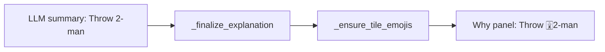

# Restore tile glyphs in Yakuman tips

## What’s wrong

Tips are plain text. “Tile images” are Unicode mahjong glyphs from [`human_tile_label`](src/shanten_sensei/tiles.py) (e.g. `🀈2-man`), not PNG chips.

- **Template** tips already call `human_tile_label` → glyphs present.
- **LLM** tips often write bare `2-man` (prompt examples omit glyphs; grounding accepts bare names). Your screenshot matches that failure mode.
- Why panel font is `Segoe UI` while AI Guidance uses `Segoe UI Emoji`, so glyphs can also fail to render even when present.

## Approach

Post-process every finalized summary so named tiles use `human_tile_label`, and align the Why font with Guidance. No rich-text / PNG tile widgets.

### 1. Ensure glyphs in [`src/shanten_sensei/explain.py`](src/shanten_sensei/explain.py)

Add `_ensure_tile_emojis(text, turn)` and call it at the end of [`_finalize_explanation`](src/shanten_sensei/explain.py) (after detail merge), so both LLM and template paths are consistent.

- Collect codes from the turn glossary (`_tile_glossary_for_turn`) plus pinned / alternate / reach-discard tiles.
- For each code, if the full `human_tile_label` is already in the text, skip.
- Otherwise replace bare aliases (same family as `_mentions_tile`: `2-man`, `2 man`, `2man`, `2m`, honor names like `West` / `Hatsu`, `red 5-sou`) with the emoji label.
- Replace longer names first (`red 5-man` before `5-man`) so aka tiles stay correct.
- Idempotent: already-glpyhed text unchanged.

### 2. Align prompt examples with intended labels

In `SYSTEM_PROMPT`, update the discard / mid-hand / defense / etc. examples to use emoji forms (`Throw 🀀West`, `Throw 🀓9-pin`, …) so the model is nudged to match `tile_glossary` instead of bare English.

### 3. Why panel font in overlay

In [`shanten-sensei-overlay/gui/main_gui.py`](file:///Users/rebeccaclarke/a_new_projects_folder/shanten-sensei-overlay/gui/main_gui.py), change `text_why` from `Segoe UI` to `Segoe UI Emoji` (same family as AI Guidance / hand strip), so glyphs render like the rest of the companion UI.

### 4. Tests

In [`tests/test_explanation_substance.py`](tests/test_explanation_substance.py) (or a small tiles/explain unit test):

- Bare `"Throw 2-man. …"` after finalize → contains `human_tile_label("2m")` (glyph + name).
- Already-glpyhed summary unchanged (no double emoji).
- Honor + aka cases (`West`, `red 5-sou`) covered.

Existing goldens that assert `"2-man" in summary` still pass (substring of `🀈2-man`).
