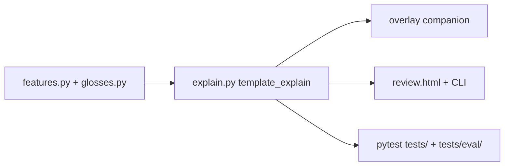

# Verify coaching substance (and the post-change test set)

## Direct answers

**Those four teaching slices are implemented**, not still designed. They live in this repo’s explainer, so overlay Chromium, Safari companion, `sensei review`, and `sensei serve` all show the same Why? once features are on the turn.

**Yes — there is a test set to run after each major change.** Default pytest already covers unit, ingest goldens, copy-sensitive eval, and grounding fuzz. Overlay has a smaller adapter suite for live wiring.



Do **not** rebuild coaching. Verify by running tests; only write code if something fails or a documented hole is real.

---

## What is already shipped (shared core)

| Slice | Where it lives | What users should hear / see |
|---|---|---|
| **Wait glosses** | [`WAIT_GLOSS`](src/shanten_sensei/glosses.py), [`_glossed_wait`](src/shanten_sensei/explain.py) | `ryanmen (two-sided open) wait` not bare `ryanmen` |
| **Furiten “because”** | [`_furiten_because_sentence`](src/shanten_sensei/explain.py) | Names discarded wait; **can’t win on any discard (only tsumo)** |
| **Defense / riichi / score** | [`basic_danger_tags`](src/shanten_sensei/features.py), [`_template_explain_riichi`](src/shanten_sensei/explain.py), [`_score_situation_sentence`](src/shanten_sensei/explain.py) | suji/one-chance/genbutsu teaching; `Declare riichi` / `Stay silent`; score one-liners **only when** `include_score_tips=True` (default **off**) |
| **Review parity** | [`serve.py` `_diverge_summary`](src/shanten_sensei/serve.py) + [`web/review.html`](web/review.html) | Aiming-for, glossed wait/shanten/danger/furiten chips, human call labels, wait-row Furiten badges |

Live overlay consumes the same `Explanation.summary`. Furiten detection on live depends on the overlay passing the player river ([`sensei_adapter.py`](file:///Users/rebeccaclarke/a_new_projects_folder/shanten-sensei-overlay/sensei_adapter.py) `player_discards_from_game_state`) and Sensei resolving the riichi cut tile ([`test_turn_from_live_reach_cut_tile_sets_waits_and_furiten`](tests/test_live.py)).

**Still out of product scope (do not treat as regressions):** temporary furiten from Mahjong Soul pass-on-win; full EV / placement math; LLM-as-judge quality scores.

---

## The post-change test set (already exists)

Documented in [`docs/testing-coaching.md`](docs/testing-coaching.md). There is **no Makefile**; one command is enough.

**After every major coaching / grounding / gloss change, from this repo:**

```bash
uv run pytest
```

That currently runs **everything** under `tests/` — unit, ingest fixtures, `-m eval` goldens, and fuzz. The eval marker exists for targeting copy-sensitive files, not for excluding them. (`docs/testing-coaching.md` says default is “unit + ingest”; pytest.ini has **no** `-m "not eval"`, so the docs are slightly stale.)

**Targeted slices when you only touched copy:**

```bash
uv run pytest -m eval
uv run pytest tests/test_explanation_substance.py tests/test_grounding.py tests/test_riichi_coaching.py tests/test_call_coaching.py tests/test_serve.py tests/test_glosses.py tests/test_features.py -q
```

**Live overlay wiring** (sibling repo; needed when discards / Why? cache / score_tips change):

```bash
cd ../shanten-sensei-overlay && pytest tests/test_sensei_adapter.py tests/test_coach_journal.py -q
```

Map of the four slices → tests:

- **Wait gloss + furiten because:** [`tests/eval/test_template_goldens.py`](tests/eval/test_template_goldens.py) `test_template_wait_gloss_and_furiten_because`; [`tests/test_glosses.py`](tests/test_glosses.py); [`tests/test_features.py`](tests/test_features.py) `test_is_furiten_*`; [`tests/test_live.py`](tests/test_live.py) river + reach-cut; overlay [`tests/test_coach_journal.py`](file:///Users/rebeccaclarke/a_new_projects_folder/shanten-sensei-overlay/tests/test_coach_journal.py) `test_build_turn_passes_player_river_for_furiten`
- **Defense / riichi / score:** goldens `test_template_suji_*`, `test_template_genbutsu_*`, `test_template_score_situation_*`; [`tests/test_riichi_coaching.py`](tests/test_riichi_coaching.py); [`tests/test_features.py`](tests/test_features.py) suji/one-chance/score builders
- **Review parity:** [`tests/test_serve.py`](tests/test_serve.py) asserts `aiming_for`, `wait_shape_label`, `danger_labels`, `furiten_label`, `furiten_blocking_tiles`, human action labels
- **Real-log smoke (not copy goldens):** [`fixtures/diverge_001`](fixtures/diverge_001) … [`005`](fixtures/diverge_005) via [`tests/test_ingest_explain.py`](tests/test_ingest_explain.py) — ingest + `validate_explanation == []`. Cut more with `scripts/extract_diverge.py`
- **Always-grounded property:** [`tests/test_grounding_fuzz.py`](tests/test_grounding_fuzz.py)

There is **no GitHub pytest CI** (only [`.github/workflows/publish.yml`](.github/workflows/publish.yml) on release). Quality after a change is a **local** run today.

---

## Verification work (when executing this plan)

1. Run `uv run pytest` in this repo and the two overlay files above. Treat failures as real quality bugs; fix those first.
2. Spot-check the four golden families against the intended voice (wait parenthetical, furiten tsumo-only, suji/riichi/score-on-flag, review payload keys). No new features.
3. Optional browser smoke of `sensei serve fixtures/review_mini/report.json`: wait chip gloss, Aiming-for, furiten note/badges if the mini report has tenpai/furiten (it may not — then rely on `test_serve.py` + a synthetic golden).
4. Docs hygiene only if we execute: one short “After a major change” block in [`docs/testing-coaching.md`](docs/testing-coaching.md) that matches reality (`uv run pytest` includes eval; overlay two-file follow-up). Do not invent a new marker or Makefile unless you ask for it.

## Known holes (do not expand unless a test fails)

- Diverge fixtures do not include a real-log **furiten tenpai** or **Declare riichi** turn; those are synthetic. Fine for a post-change gate; harvest later if you want log-shaped copy pins.
- Review has **API** coverage, not Playwright E2E.
- Overlay `test_sensei_adapter.py` does not re-assert furiten (that lives in `test_coach_journal.py`).
- Score sentences are easy to “lose” in a screenshot if the overlay/review **Point situation tips** checkbox is off — that is intentional.

## Out of scope

- New coaching branches, glossary UI, temporary-furiten live hook
- LLM-as-judge / human rubric
- Adding pytest to GitHub Actions (optional follow-up if you want CI to own the gate)
