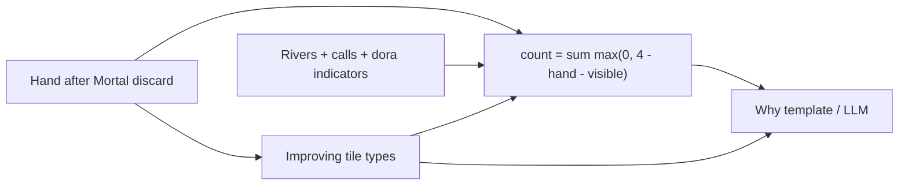

# Visible-adjusted ukeire in Why?

## Why

Mortal already sees rivers via full mjai state. Sensei’s `calculate_ukeire` only does `4 - copies_in_hand`, so status/Why can say “~51 acceptances” even when many improving tiles are already in rivers. We cannot claim Mortal’s *internal* reason, but we **can** ground “several improving tiles are already out” from deterministic visible counts.

## Decision

**Visible-adjusted count becomes the primary `ukeire.count`** everywhere (status strip, CLI, Why template). Improving tile *types* stay the same; only remaining copies change. When no rivers/calls/indicators are available (thin fixtures), behavior matches today.



## 1. Feature math — [`features.py`](src/shanten_sensei/features.py)

- Add `collect_visible_tiles(...)` that flattens:
  - all `visible_discards` rivers (fallback: `discards` when rivers empty)
  - own `calls` tiles (reuse `_tiles_from_calls`)
  - `dora_indicators`
- De-aka via existing `deaka` / `visible_tile_counts`.
- Extend `calculate_ukeire(..., visible_tiles: list[str] | None = None)`:
  - same improving-tile scan as today
  - `remaining += max(0, 4 - working[idx] - visible_outside[idx])`
  - return per-tile remaining for improving tiles only
- Wire through `extract_features` (already receives `visible_discards` / `calls` / `dora_indicators`).

Out of scope for this pass: opponent open melds (not in `mjai_board` yet). Rivers + indicators cover the main teaching case.

## 2. Schema — [`schema.py`](src/shanten_sensei/schema.py)

Extend `UkeireInfo`:

```python
class UkeireInfo(BaseModel):
    count: int
    tiles: list[str] = Field(default_factory=list)
    remaining_by_tile: dict[str, int] = Field(default_factory=dict)
```

Optional contrast for diverge/next-best dahai (same visible pool, different cut):

```python
# on DerivedFeatures
ukeire_alt: UkeireInfo | None = None  # after player_action / next_best dahai when applicable
```

Compute `ukeire_alt` in ingest/live when the contrasted action is `dahai …` and differs from Mortal’s cut (reuse `calculate_ukeire` + `after_discard`). Keep `None` for non-dahai / same tile.

## 3. Explain — [`explain.py`](src/shanten_sensei/explain.py)

**Payload:** `ukeire` already dumped; ensure `remaining_by_tile` and `ukeire_alt` ride along. Add a short `wall_note` helper used by template and as a payload hint, e.g. only when depletion is meaningful:

- any improving tile with `remaining <= 1`, or
- `ukeire_alt` present and `ukeire.count` beats it by ≥ 3

Phrasing examples (grounded only):

- `several improving tiles are already out (only 1× 4-sou left)`
- `keeps more live acceptances (~8 vs ~3 after cutting 5-sou)`

**SYSTEM_PROMPT:** Allow citing `ukeire.remaining_by_tile` / `ukeire_alt` for wall-depletion or live-acceptance contrast; forbid inventing unseen wall math or opponent-hand claims.

**Substance:** Treat wall/depletion language (`already out`, `left in the wall`, `live acceptances`, concrete `N×` remaining) as an `ukeire` anchor when `remaining_by_tile` or `ukeire_alt` is present — so thin “more efficient” text still repairs to template.

**Template:** Prefer existing shanten/wait/shape bits; append wall note when the helper fires (don’t crowd every turn).

## 4. API / UI

- [`serve.py`](src/shanten_sensei/serve.py): keep exposing `ukeire` / `ukeire_tiles`; optionally add `ukeire_remaining` from `remaining_by_tile` for future UI (strip can keep showing the adjusted count only).
- Review HTML needs no redesign; chip numbers simply become visible-adjusted when rivers exist.

## 5. Tests

- Unit: hand + river containing one wait tile → count drops by that many (e.g. ryanmen waits `4s`/`7s`, two `4s` in rivers → count `4` not `6`).
- Unit: no visible tiles → same as current golden `count == 6`.
- Template/substance: when `remaining_by_tile` is thin, template mentions “already out” / `N×`; when alt ukeire is worse, contrast phrase appears.
- Update any fixtures/asserts that assumed optimistic counts once rivers are present ([`tests/test_features.py`](tests/test_features.py), ingest/serve if needed).

## Quality bar (what “good” means here)

- Never say “Mortal cut X because Y was discarded” unless Y is in `remaining_by_tile` / visible pool.
- Prefer silence over a weak wall sentence when depletion isn’t meaningful.
- Numbers in Why must match `ukeire.count` / `remaining_by_tile` (same grounding style as shape goals).
