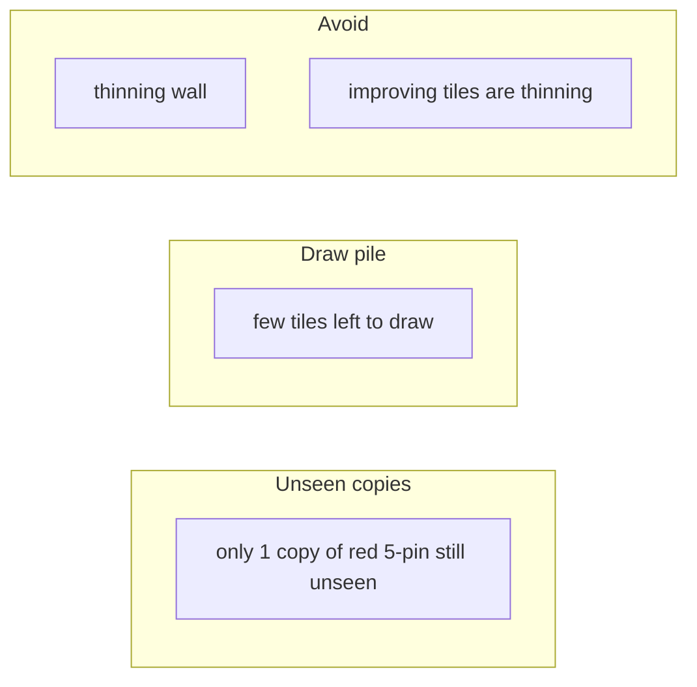

# Wall / depletion phrasing clarity

## Problem (refined)

Three different ideas get muddled in current copy:

| Concept | What it means | Current risky phrases |
|---------|---------------|----------------------|
| **Draw pile** | How many tiles can still be drawn (`tiles_left`) | “wall is getting thin”, “late game / thin wall” |
| **Unseen copies** | How many of a specific tile are still findable (`remaining_by_tile`) | “thinning wall”, “improving tiles are thinning” |
| **Ukeire count** | How many tile *types* improve the hand | “about 91 improving tiles” |

**“Improving tiles are thinning”** sounds like the first row (late game, few draws left), not the second (only 1 copy of red 5-pin is still unseen). Beginners will misread it.

**Do not add “thinning wall” to the glossary.** A parenthetical definition would still fight the draw-pile meaning, and the concrete fact (“only 1× red 5-pin left”) is what actually teaches. The known-terms checklist is for stable vocabulary (shanten, ukeire, genbutsu) — not for compound jargon we can avoid.

## Locked voice (copy-specific, no “thin/thinning”)

### Unseen-copy facts (`remaining_by_tile` ≤ 1)

Lead with **tile + copy count**, not “thin”:

| Case | New phrasing |
|------|----------------|
| 1 copy left | `only 1 copy of {tile} is still unseen` |
| N copies left | `only {N}× {tile} still unseen` |
| 0 copies | `{tile} is already out` |
| Multiple scarce | `few copies left of tiles you need ({detail})` |

Examples:

- `only 1 copy of red 5-pin is still unseen`
- `red 5-pin is already out`
- `few copies left of tiles you need (only 1× green dragon still unseen)`

**Avoid:** “thinning wall”, “improving tiles are thinning”, “left in the wall”.

### Ukeire contrast (`ukeire_alt` branch — unchanged)

Keep the existing contrast line — it names counts, not “thin”:

> about 55 improving tiles left vs about 41 if you throw 7-sou

### Draw-pile late game (`tiles_left` — separate concept)

When score/riichi tips mean *few draws remain*, say that plainly:

- `few tiles left to draw` (not “thin wall” / “wall is getting thin”)

Only use this when `tiles_left` / `score_situation.late_game` applies — never mix it into unseen-copy notes.

## Code changes ([`src/shanten_sensei/explain.py`](src/shanten_sensei/explain.py))

### 1. `_wall_note_detail` thin branch

Replace:

```python
return "thin", f"improving tiles are thinning ({detail})"
```

With copy-specific sentences (no wrapper clause needed when single tile):

```python
# n == 1
return "thin", f"only 1 copy of {label} is still unseen"
# n == 0  
return "thin", f"{label} is already out"
# multiple
return "thin", f"few copies left of tiles you need ({detail})"
```

Mirror the same voice in `_thin_wall_sentence`.

### 2. Call template

In `_template_explain_call`, when `best_kind == "none"` and `_wall_note_detail` returns `"thin"`, append the wall note (same helper — call tips currently omit it, so LLM drifts into jargon).

### 3. `SYSTEM_PROMPT`

- **Forbid:** “thinning wall”, “thin wall”, “improving tiles are thinning”, “left in the wall”.
- **Require:** rephrase `wall_note` using copy-specific unseen language above.
- Locked example (call skip + scarce tile):

> Skip the chi on 3-man. You're 5-shanten (5 steps from ready) closed with about 91 improving tiles. Calling would open the hand. Only 1 copy of red 5-pin is still unseen.

### 4. Late-game lines

- Riichi: `"The wall is getting thin"` → `"Few tiles left to draw"`
- Score detail: `"late game / thin wall"` → `"late game — few tiles left to draw"`

## Tests ([`tests/test_explanation_substance.py`](tests/test_explanation_substance.py))

- Update `test_wall_note_thin_remaining` and template goldens for new strings.
- Assert summaries do **not** contain `thinning` / `thin wall` unless paired with `still unseen` or `already out` (optional validator).
- Call-skip golden with `remaining_by_tile` ≤ 1 includes unseen-copy line, not draw-pile language.

## Out of scope

- Adding `wall` or `wall_thinning` to `GLOSS_CHECKLIST` — copy fix removes the need
- Changing ukeire / shanten gloss behavior


