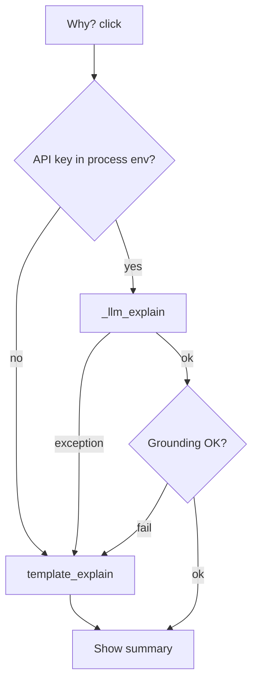

# Diagnose thin Why? explanations

## What’s happening

The line in your screenshot:

> Mortal prefers 7p over 9s; you're 3-shanten with about 51 acceptances.

is produced by [`template_explain()`](src/shanten_sensei/explain.py) — the deterministic offline fallback — not by the LLM coach. That path only stitches Mortal vs next-best + shanten/ukeire count; it never uses Mortal probs, ukeire tile list, dora, or score context.

Live overlay calls `explain(turn)` (see [`docs/phase2-kickoff.md`](docs/phase2-kickoff.md) / [`docs/live-setup.md`](docs/live-setup.md)): LLM only if `OPENAI_API_KEY` or `SENSEI_API_KEY` is set on that process; otherwise template. Failures are swallowed and replaced with template.

## What to check (in order)

1. **Confirm it’s the template**  
   Exact semicolon pattern `"Mortal prefers …; you're N-shanten with about X acceptances."` = template. If LLM worked you’d get different prose (still 1–2 sentences by design).

2. **API key visible to the overlay process**  
   - Key must be in the environment **before** starting the overlay (`python main.py`), not only in a shell you didn’t launch from.  
   - Check for `.env` in the overlay cwd vs Sensei repo — overlay may not load Sensei’s `.env`.  
   - Docs already call this out: [docs/live-setup.md](docs/live-setup.md) → “Generic / template Why? text”.

3. **Silent LLM failure**  
   Even with a key, network / auth / parse errors fall through to template with no UI badge. Check overlay logs around Why? for httpx / 401 / timeout. Quick isolation: from the Sensei venv, run a one-off `sensei explain … --llm` (or a tiny script calling `explain_llm`) with the same key.

4. **Grounding repair**  
   If the LLM returned text that failed `validate_explanation`, you’d see `(grounding repair: …)` appended. Your screenshot has no such suffix → either never hit LLM, or LLM never returned (exception path).

5. **Expectations even when LLM works**  
   [`SYSTEM_PROMPT`](src/shanten_sensei/explain.py) hard-caps to “One or two sentences”; `validate_explanation` rejects summaries over 80 words. So “rich coaching essay” is out of scope for the current product — but LLM text should still mention concrete shape/efficiency reasons from the payload, not just shanten + ukeire count.

## Likely outcome

You’re on the no-key or failed-LLM path. Fixing env so Why? hits `_llm_explain` is the first fix. Only if LLM is already working and still feels too thin should we widen the prompt / template (separate change).

## Out of scope for this check

- Enriching `template_explain` with probs / ukeire tiles  
- Longer multi-paragraph coach mode  
- Overlay UI “offline template” badge (nice-to-have if silent fallback keeps confusing)