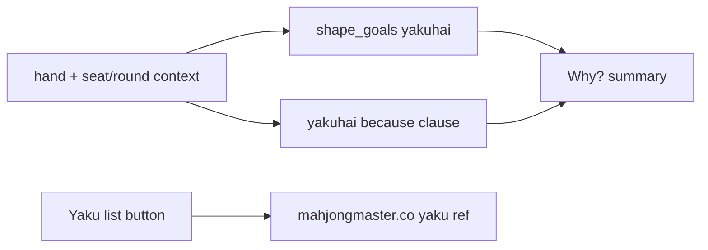

# Yakuhai “because” + Yaku list link

## Problem

Screenshot Why? text (LLM path):

> …while throwing Chun would not help your current shape aiming for yakuhai (dragon or seat/round wind).

The parenthetical only restates the gloss. It never says **what yakuhai needs** (a triplet) or **which tiles in this hand** already support it (East×2 as seat/round wind), so “Chun would not help” stays opaque.

Today only **tanyao** gets a causal append (`—West can’t stay in that hand`) in [`template_explain`](src/shanten_sensei/explain.py). Yakuhai has no analogue. Glosses live in [`glosses.py`](src/shanten_sensei/glosses.py); the live Aiming-for strip is in the sibling overlay.

## Locked voice (screenshot hand)

After change, template/LLM should sound like:

> Throw 1-man, not Chun. … That fits yakuhai (triplet of dragon or your seat/round wind)—you’re holding a pair of East for that; 1-man isn’t a value tile, while Chun can still pair.

Not bare “would not help … aiming for yakuhai.”

## 1. Richer yakuhai gloss

In [`src/shanten_sensei/glosses.py`](src/shanten_sensei/glosses.py):

```python
"yakuhai": "triplet of dragon or your seat/round wind",
```

Updates Aiming-for + Why? parentheticals together via `glossed_goal` / `GOAL_GLOSS`.

## 2. Hand-specific yakuhai “because” (template + payload)

Mirror the tanyao causal pattern in [`explain.py`](src/shanten_sensei/explain.py).

**Helpers** (no new schema field — derive from hand + `features.context`, same rules as [`infer_shape_goals`](src/shanten_sensei/features.py)):

- `_yakuhai_value_tiles(context)` → dragons + seat/round winds from context keys
- `_yakuhai_pair_labels(hand, context)` → human labels for value tiles with count ≥ 2 (e.g. `East`)
- `_yakuhai_because_clause(turn, best_raw, alt_raw)` → short em-dash clause when `"yakuhai"` ∈ `shape_goals`

**Clause rules** (keep ≤1 short append, like tanyao):

- Always name the held pair/triplet: `you’re holding a pair of {East} for that`
- If Mortal’s cut is **not** a yakuhai value tile: `; {1-man} isn’t a value tile`
- If contrasted alt **is** a yakuhai-capable tile (dragon / seat / round) still in hand at count 1+: `; while {Chun} can still pair` (or `is already a pair` if count ≥ 2)

Wire into `template_explain` next to the existing tanyao append (~lines 599–604).

**LLM grounding:** put in `build_user_payload`:

- `yakuhai_pairs`: list of human labels
- `yakuhai_singleton_value_tiles`: dragons/seat/round still at count 1

Nudge `SYSTEM_PROMPT`: when naming yakuhai, include the glossary parenthetical **and** a because clause from those tile facts; forbid vague “would not help … aiming for yakuhai” without naming the pair/triplet tiles.

## 3. Yaku list link (Sensei constant + overlay button)

**URL (locked):** [Mahjong Master — complete riichi yaku reference](https://www.mahjongmaster.co/learn/riichi/yaku/) — card UI for all 43 yaku with examples (beginner-friendly scan).

In [`glosses.py`](src/shanten_sensei/glosses.py):

```python
YAKU_REFERENCE_URL = "https://www.mahjongmaster.co/learn/riichi/yaku/"
YAKU_REFERENCE_LABEL = "Yaku list"
```

**Sibling overlay** ([`shanten-sensei-overlay/gui/main_gui.py`](file:///Users/rebeccaclarke/a_new_projects_folder/shanten-sensei-overlay/gui/main_gui.py)):

- Next to the Aiming-for header / Why? button, add a small ttk button or underlined label `Yaku list`
- On click: `webbrowser.open(YAKU_REFERENCE_URL)` (import from `shanten_sensei.glosses` in [`sensei_adapter.py`](file:///Users/rebeccaclarke/a_new_projects_folder/shanten-sensei-overlay/sensei_adapter.py) or GUI)
- Add string to [`lan_str.py`](file:///Users/rebeccaclarke/a_new_projects_folder/shanten-sensei-overlay/common/lan_str.py) (`YAKU_LIST = "Yaku list"`)

Always visible (not only when Aiming-for has a tag) — beginners need it most when the gloss is confusing.

Optional tiny addition in review HTML if a footer/help row already exists; otherwise overlay-only is enough for the live screenshot flow.



## 4. Tests

- [`tests/test_glosses.py`](tests/test_glosses.py) — yakuhai gloss contains `triplet`
- [`tests/test_shape_goals.py`](tests/test_shape_goals.py) / [`tests/test_explanation_substance.py`](tests/test_explanation_substance.py) — golden: yakuhai from East pair + cut `1m` + alt `C` → summary has `fits yakuhai`, `pair of East` (or `East`), and `Chun` / value-tile contrast; not bare “would not help”
- Update any assertions that expect the old yakuhai gloss string `dragon or seat/round wind`

## Out of scope

- Changing when `yakuhai` is tagged (still pair/triplet heuristic)
- Hosting our own yaku image gallery
- Claiming Mortal’s internal yaku plan beyond heuristic `shape_goals`
