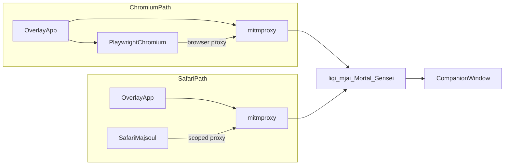

# Dual-client local install — architecture

One local Sensei + overlay install; two ways to play Majsoul next to the coach. This doc is the contract for maintainers and future implementers.

**Status today**

| Path | Status |
|------|--------|
| Chromium (Playwright) | Supported — see [`live-setup.md`](live-setup.md) |
| Safari + companion window | Designed here; **not shipped** as a polished UX yet |
| Mac Majsoul native app | **Out of scope** |
| Hosted live / zero-install proxy | **Out of scope** |

Security and trust rules: [`proxy-trust-precautions.md`](proxy-trust-precautions.md).

---

## Product model

Users install the overlay fork locally (sibling of this repo). They arrange **two windows side by side**:

- **Game** — Majsoul in Chromium (today) or Safari (future)
- **Coach** — the overlay’s tkinter companion window (`gui/main_gui.py`): status, Mortal tip, **Why?**, practice banner

Safari path does **not** inject an in-page HUD into Safari. Chromium may still use the optional Playwright canvas overlay; coaching truth lives in the companion window either way.

Practice / friend / vs-AI only. Ranked assistance is not a product goal; Why? stays gated when ranked is detected (`sensei_mode.py` in the overlay).

---

## Shared core (unchanged across clients)

Both paths feed the same pipeline. Only **how traffic reaches mitmproxy** differs.

```text
Majsoul WebSocket
      │
      ▼
mitmproxy (loopback)  →  liqi protobuf decode  →  mjai events
      │
      ▼
Mortal (local .pth)  →  recommended action + values
      │
      ▼
Sensei (this repo): live features + explain() / Why?
      │
      ▼
Companion window (and optional Chromium in-page HUD)
```

| Stage | Overlay / Sensei location |
|-------|---------------------------|
| MITM + WS queue | `shanten-sensei-overlay/mitm.py` |
| Protocol decode | `liqi.py` + proto assets |
| Game state / bot loop | `bot_manager.py`, `game/game_state.py` |
| Client kind | `GameClientType.PLAYWRIGHT` vs `PROXY` in `common/utils.py` |
| Mode gate | `sensei_mode.py` |
| Why? adapter | `sensei_adapter.py` → Sensei `live` / `explain` |
| Companion UI | `gui/main_gui.py` |

---

## Path A — Chromium (supported today)

1. Overlay starts mitmproxy on `127.0.0.1:{mitm_port}` (HTTP mode; config under `mitm_config/`).
2. User clicks **Start Browser** (or enables auto-launch). Playwright launches **Chromium** with a **browser-only** proxy pointing at that mitm URL (`game/browser.py`).
3. Traffic never needs OS-wide proxy settings; only the app-owned Chromium goes through MITM.
4. Optional in-page HUD: canvas injected via Playwright `page.evaluate` when Overlay is toggled on.
5. Companion GUI runs regardless; Why? and status are available there.

Docs for players: [`live-setup.md`](live-setup.md).

---

## Path B — Safari (designed; implement later)

Goal: users who will not use Chromium play Majsoul in **Safari**, with the same companion coach beside it.

### Intended UX

1. Start overlay → mitm starts; **do not** start Playwright Chromium.
2. User enables a **scoped** Safari/macOS proxy session that sends **Majsoul hosts only** to `127.0.0.1:{mitm_port}` (see precautions doc).
3. Trust the local mitm CA (per-machine under `mitm_config/`).
4. Open Majsoul in Safari (e.g. YoStar English URL).
5. When lobby/game WS hits mitm without Playwright, overlay already classifies the client as `GameClientType.PROXY` (“Proxy Client”).
6. Coach UI is **companion window only** — no Safari content-script / in-page HUD in v1.
7. On quit: tear down scoped proxy (and document manual off steps).

### Design requirements for later code

| Requirement | Why |
|-------------|-----|
| Loopback-only mitm listen | No LAN exposure of the intercept |
| Domain-scoped proxy (Majsoul hosts), not permanent system-wide proxy | Limits blast radius; see precautions |
| Clear ON/OFF tied to overlay start/stop | Users must not leave intercept on after coaching |
| Companion-only UI for Safari | Avoid injecting privileged scripts into the Majsoul page |
| Reuse `PROXY` client path | Capture/core already exist when WS arrives without Playwright |
| Same practice-only gate | No special case for Safari ranked |

### Modules to extend (when implementing)

- Settings / toolbar: explicit “Safari / external browser” mode vs “Start Browser”
- macOS helper to apply/remove a **PAC or scoped proxy** for Majsoul domains only
- Cert install UX on Darwin (existing `install_mitm_cert` / `security` helpers are marked needs verification)
- Status copy: dual-window instructions; disable or hide Chromium-only Overlay HUD controls in Safari mode
- Docs: player steps in `live-setup.md` once the button path ships

### Majsoul host hints

Overlay already treats related hosts for proxy filtering concepts (e.g. `mahjongsoul.com`, `yo-star.com` in `common/utils.py`). Implementation should keep the allowlist tight and review CDN/WS hostnames against a real Safari session before shipping.

---

## Window layout

Intended arrangement (user-managed; no forced tiling in v1):

```text
┌─────────────────────────────┐  ┌──────────────────────┐
│  Majsoul (Chromium or Safari)│  │  Sensei companion    │
│                             │  │  status / tip / Why? │
└─────────────────────────────┘  └──────────────────────┘
```

---

## Non-goals

- Mac Majsoul **native app** capture (no macOS proxinject; Windows inject stays Windows-only)
- Zero-install **hosted live** website that proxies Majsoul through our servers
- Safari **in-page** HUD / Web Extension coach in v1
- Ranked / ladder assistance
- Merging the GPL overlay into this repo

---

## Flow diagram



---

## Related docs

| Doc | Role |
|-----|------|
| [`live-setup.md`](live-setup.md) | How to play live today (Chromium) |
| [`proxy-trust-precautions.md`](proxy-trust-precautions.md) | Cert / proxy trust rules |
| [`phase2-kickoff.md`](phase2-kickoff.md) | Adapter + mode-gate kickoff |
| Overlay repo | Capture UI, mitm, Playwright |
